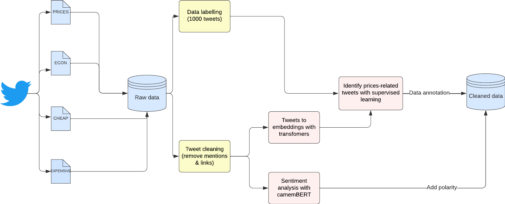

# twitter-inflation-perception

## Context

Last year was marked by rampant inflation, which keeps having a negative impact on the global economy as of today. Monitoring the evolution of inflation through precise measurement is thus a crucial matter for central banks and other institutions. 

Simply put, inflation rate is measured by comparing the current prices of a set of goods and services to previous prices. Inflation is generally calculated by statistical and economic institutions such as Insee and Banque de France. The latter also studies inflation perception through survey and social media analysis. Specifically, Banque de France has tried to gather insights on how people perceive and discuss inflation on social media, and to use this information to better understand their economic sentiments and expectations. 

Inspired by [[1]](#1), our project aims to measure inflation perception by analyzing Twitter data using Natural Language Processing (NLP) techniques. By leveraging the vast amount of text data available on Twitter, the project hopes to provide indicators that may be valuable to understand inflation dynamics. 

## Objective 

To evaluate inflation perception, we calculate the daily number of tweets about inflation or prices as well as measuring the sentiment of each tweet with transformer-based models. 

## Project overview

### Workflow

<figure>

<figcaption><i>Conceptual schema of the project</i></figcaption>
</figure>

### Library 

The python implementation of the data process depicted above consists in a library named [`lib`](lib/) which is made up of different sub-modules: 

| Module | Description   |
|---|---|
| [`preprocessing`](lib/preprocessing/)  | Clean tweets, text preprocessing, embeddings |
| [`sentiment`](lib/sentiment/) | Load transformer model, training, validation |
| [`annotate`](lib/annotate.py) | Data labelling |
| [`get_tweets`](lib/get_tweets.py) | Twitter data scraper based on `Scweet` |
| [`enums`](lib/enums.py) | Keywords sorted by lexical field |
| [`utils`](lib/utils.py) | Useful functions |

Note the unit tests which evaluate the well functioning of `lib` are located in the [`tests/`](tests/) folder. Here is the summary of the code covered by the tests we developed: 

```
(env) ~\twitter-inflation-perception>pytest tests======================================================= test session starts ======================================================= 
platform win32 -- Python 3.9.9, pytest-7.2.1, pluggy-1.0.0
rootdir: C:\Users\pemma\OneDrive - GENES\Ensae\S1\ML Python\Projet\twitter-inflation-perception
plugins: mock-3.10.0collected 18 items

tests\test_annotate.py .                                                                                                     [  5%]
tests\test_preprocessing.py ............                                                                                     [ 72%]
tests\test_sentiment.py ...                                                                                                  [ 88%]
tests\test_utils.py ..                                                                                                       [100%]

======================================================= 18 passed in 21.63s =======================================================
```

### Installation

One can run the following commands in the command prompt to create a virtual environment and install all the necessary libraries which `lib` depends on. 

```
> python -m venv env
> env\Scripts\activate.bat 
> pip install -r requirements.txt
```

## Data collection

The first step lies in defining the data collection strategy. After having tested multiple solutions like `Twint` and `tweepy`, we have to cope with technical issues and/or limitations. Fortunately, the [`Scweet`](https://pypi.org/project/Scweet/) library fits our expectations as it is a simple and unlimited Twitter scraper with python which enables query by keywords over a given period of time. It is decided to query tweets from 2020 to 2022 for the following keywords, sorted by lexical field: 

| ECONOMICAL TERMS  |  PRICES | CHEAP  | EXPENSIVE  | INSTITUTIONS  | ENGLISH  |
|---|---|---|---|---|---|
| inflation, deflation, stagflation,desinflation, etc. | prix, tarif, montant, coût, etc. | onéreux, cher, prohibitif, couteux, etc.  |  aubaine, modeste, clopinettes, bon prix, etc.  |BCE, banque centrale, INSEE, etc.  | price, cost, etc. |

Using the scraping function in [`get_tweets`](lib/get_tweets.py), we are able to retrieve multiple tweets with keywords in each lexical field. We thus obtain multiple documents which are then merged, as represented in the conceptual schema. The final datasets is made up of more than 90k tweets for each we have the username, date, text, number of retweets/likes/comments and the url. 

## Data preprocessing 

Three main steps can be highlighted in terms of data preprocessing applied on the data collected from Twitter.

### Cleaning tweets

The first step consists in removing polutting items from the the text of each tweet such as:
- the number of retweets/likes/comments, 
- the date, 
- the eventual items "Show this thread" or "Replying to". 

For instance, the tweet "My friend @joe and I use this website https://stackoverflow.com/ to get help on our python project" becomes "My friend and I use this website to get help on our python project". 

### Text preprocessing

The usual components of text preprocessing like tokenization, removing stopwords and punctuation as well as stemming are also implemented in `lib` and can be used on the tweets. The underlying objective of these transformations is to use them upstream of word2vec. However, we decid not to use the word2vec algorithm in favor of more advanced methods based on transformers. The latter having already implemented text preprocessing methods, we thus do not use the ones in `lib`. 

### Manual data annotation 

Since the project's purpose is to measure inflation perception through Twitter data, we need to make sure the collected tweets are about prices. To that end, we decide to manually label 1,000 tweets. More precisely, it consists in assessing whether the tweet is about prices or not leveraging the features of [`ipyannotations`](https://ipyannotations.readthedocs.io/en/latest/). More details can be found in the [`tw-labelling`](notebooks/tw-labelling.ipynb) notebook. 

## Modeling process

## Building an indicator of inflation perception

## References

<a id="1">[1]</a> 
Julien Denes & Ariane Lestrade & Lou Richardet, 2022.
"<B><A HREF="https://ideas.repec.org/h/bis/bisifc/57-13.html">Using twitter data to measure inflation perception</A></B>,"
<A HREF="https://ideas.repec.org/s/bis/bisifc.html">IFC Bulletins chapters</A>, in:  Bank for International Settlements (ed.), <A HREF="/b/bis/bisifb/57.html">Machine learning in central banking</A>, volume 57,
Bank for International Settlements.
