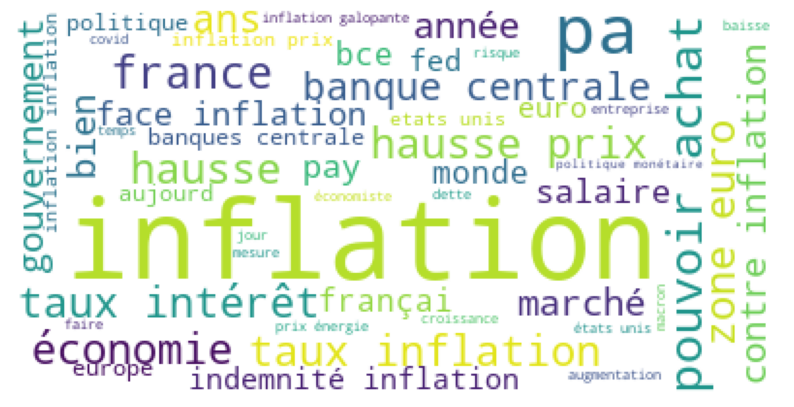

# twitter-inflation-perception

## Context

Last year was marked by rampant inflation, which keeps having a negative impact on the global economy as of today. Monitoring the evolution of inflation through precise measurement is a crucial matter for central banks and other institutions. 

Simply put, inflation is measured by comparing the current prices of a set of goods and services to previous prices. Inflation is generally calculated by statistical and economic institutions such as Insee and Banque de France. The latter also studies inflation perception through survey and social media analysis. Specifically, Banque de France has tried to gather insights on how people perceive and discuss inflation on social media, and to use this information to better understand their economic sentiments and expectations. 

Inspired by [[1]](#1), our project aims to measure inflation perception by analyzing Twitter data using Natural Language Processing (NLP) techniques. By leveraging the vast amount of text data available on Twitter, the project hopes to provide indicators that may be valuable to understand inflation dynamics. 

## Objective 

**To assess inflation perception, we build a custom indicator which counts the daily number of tweets about inflation or prices and measures the sentiment of each tweet with transformer-based models. By doing so, we aim at getting insights on both the volume of inflation-related tweets and their polarity.**

## Project overview

### Dataset workflow 

Our project adopts a data-centric approach since emphasis is placed on the techniques which permit to obtain an accurate dataset of tweets related to prices and inlfation.

<figure>

<figcaption><i>Conceptual schema of the dataset creation</i></figcaption>
</figure>

### Library 

The python implementation of the data process depicted above consists in a library named [`lib`](lib/) which is made up of different sub-modules: 

| Module | Description   |
|---|---|
| [`preprocessing`](lib/preprocessing/)  | Clean tweets, text preprocessing, embeddings |
| [`sentiment`](lib/sentiment/) | Load transformer model, training, validation |
| [`annotate`](lib/annotate.py) | Data labelling |
| [`get_tweets`](lib/get_tweets.py) | Twitter data scraper based on `Scweet` |
| [`enums`](lib/enums.py) | Keywords sorted by lexical field |
| [`utils`](lib/utils.py) | Useful functions |

The unit tests which evaluate the well functioning of `lib` are located in the [`tests/`](tests/) folder. Here is the summary of the code covered by the tests we developed: 

```
(env) ~\twitter-inflation-perception>pytest tests======================================================= test session starts ======================================================= 
platform win32 -- Python 3.9.9, pytest-7.2.1, pluggy-1.0.0
rootdir: C:\Users\pemma\OneDrive - GENES\Ensae\S1\ML Python\Projet\twitter-inflation-perception
plugins: mock-3.10.0collected 18 items

tests\test_annotate.py .                                                                                                     [  5%]
tests\test_preprocessing.py ............                                                                                     [ 72%]
tests\test_sentiment.py ...                                                                                                  [ 88%]
tests\test_utils.py ..                                                                                                       [100%]

======================================================= 18 passed in 21.63s =======================================================
```

### Installation

One can run the following commands in the command prompt to create a virtual environment and install all the necessary libraries which `lib` depends on. 

```
> python -m venv env
> env\Scripts\activate.bat 
> pip install -r requirements.txt
```

## Data collection

The first step lies in defining the data collection strategy. After having tested multiple solutions like `Twint` and `tweepy`, we have to cope with technical issues and/or limitations. Fortunately, the [`Scweet`](https://pypi.org/project/Scweet/) library fits our expectations as it is a simple and unlimited Twitter python scraper which enables query by keywords over a given period of time. It is decided to query tweets from 2020 to 2022 for the following keywords, sorted by lexical field: 

| ECONOMICAL TERMS  |  PRICES | CHEAP  | EXPENSIVE  | INSTITUTIONS  | ENGLISH  |
|---|---|---|---|---|---|
| inflation, deflation, stagflation,desinflation, etc. | prix, tarif, montant, coût, etc. | onéreux, cher, prohibitif, couteux, etc.  |  aubaine, modeste, clopinettes, bon prix, etc.  |BCE, banque centrale, INSEE, etc.  | price, cost, etc. |

Using the scraping function in [`get_tweets`](lib/get_tweets.py), we are able to retrieve multiple tweets with keywords in each lexical field. We thus obtain multiple documents which are then merged, as represented in the conceptual schema. The final dataset is made up of more than 90k tweets for each we have the username, date, text, number of retweets/likes/comments and the url. 

## Data preprocessing 

Three main steps can be highlighted in terms of data preprocessing applied on the data collected from Twitter.

### Cleaning tweets

The first step consists in removing polluting items from the the text of each tweet such as:
- the number of retweets/likes/comments, 
- the date, 
- the eventual items "Show this thread" or "Replying to". 

For instance, the tweet "My friend @joe and I use this website https://stackoverflow.com/ to get help on our python project" becomes "My friend and I use this website to get help on our python project". 

### Text preprocessing

The usual components of text preprocessing like tokenization, removing stopwords and punctuation as well as stemming are also implemented in `lib` and can be used on the tweets. The underlying objective of these transformations is to remove the noise contained in the text before data exploration. Once cleaned, it is interesting to measure the frequency of each word so as to identify the more representative of our corpus. 

<figure>

<figcaption><i>Wordcloud of our Twitter corpus</i></figcaption>
</figure>

Note that a dynamic visualisation of topics identified with Latent Dirichlet Allocation (LDA) can be downloaded [here](./figs/lda_4_topics.html).

### Manual data annotation 

Since the project's purpose is to measure inflation perception through Twitter data, we need to make sure the collected tweets are about prices. To that end, we decide to manually label 1,000 tweets. More precisely, it consists in assessing whether the tweet is about prices or not leveraging the features of [`ipyannotations`](https://ipyannotations.readthedocs.io/en/latest/). These annotated tweets are further used as training set for classification models whose goal is to identify prices-related tweets.

First, we labeled the tweets according to whether they were about inflation, disinflation, deflation, price stability, something else about prices or whether they are not about prices. However, we realized that with 1,000 tweets labeled we only had about 30 tweets about prices that were not in the inflation category. Due to this issue of imbalanced classes, it is decided to keep the labels "about prices" - in which all the previously mentioned labels were grouped - and "not about prices". 

More details can be found in the [`tw-labelling`](notebooks/tw-labelling.ipynb) notebook. 

### Embedding 

Each tweet was converted into a numerical vector called embedding using the [`SentenceTransformers`](https://www.sbert.net/) python framework (`all-MiniLM-L6-v2`). Tweets are therefore translated into a 384-dimension space. This method is helpful to get numerical features on which a classification model can be trained. 

See the [tw-embeddings](notebooks/tw-embeddings.ipynb) notebook and [lib.preprocessing.embeddings](lib/preprocessing/embeddings.py) for more details.

## Modeling process

### Filtering prices-related tweets

In order to identify tweets related to prices and inflation, we fit a classification model of the tweets using their embeddings. After a test train split at 33% of the labeled dataset, several types of models are trained: linear SVC, random forest and XGBoost. These choices are motivated by the fact that embeddings convert text into a high-dimensional (384) space. 

The optimization of the hyperparameters is performed with the means of the `optuna` library.

The best result is obtained with XGboost. On the test sample  $\text{recall}=\frac{TP}{TP+FN}$ is 80% and its $\text{precision}=\frac{TP}{TP+FP}$ is 72%. The global accuracy is 84%. With a constant model, changing the decision threshold to increase recall or precision could have been imagined. We did not make this choice, yet it is to discuss.

Once the best model trained on the whole annotated dataset, we predict the class of the ~ 90,000 unlabeled tweets.

With more time, we could have performed a manual check of the classified tweets, then retrain the model focusing on the points for which the classifier made a mistake. 

### Sentiment analysis 

With the objective to get more information than just whether a tweet is about prices or not, sentiment analysis is conducted to predict the polarity of a tweet.

For this purpose, [`camemBERT`](https://huggingface.co/camembert-base), a transformer-based model trained on French language data is fine-tuned on a french tweets dataset which comes from [Kaggle](https://www.kaggle.com/datasets/hbaflast/french-twitter-sentiment-analysis?resource=download&select=french_tweets.csv). We use Google Colaboratory for training since `camemBERT` is large language model of more than 110 milion parameters. The code and the results can be consulted [here](./notebooks/tw-sentiment-camembert.ipynb). 


## Building an indicator of inflation perception

Once the Twitter dataset filtered with the previously introduced custom technique, we have a cleaned dataset of 24, 312 tweets potentially related to prices over the 2020-2022 period.

As in [[1]](#1), we count the daily number of tweets mentioning prices. We extend the analysis by counting the number of tweets with positive (resp. negative) polarity and calculting the daily average polarity of tweets using the predictions of fine-tuned `camemBERT`. We thus get a Twitter indicator which is divided into two parts: number of prices-related tweets and sentiment of tweets. 

With a view to get some insight on the accuracy of our methodology, we compare our indicators to the monthly inflation rate between 2020 and 2022. The data comes from the OCDE [website](https://data.oecd.org/fr/price/inflation-ipc.htm). Then, each part of the Twitter indicator is aggregated on a monthly basis. We start by representing the evolution of both the inflation rate and our custom indicators and calculate correlations. 

<figure>

<figcaption><i>Pearson linear correlation coefficient between inflation rate and Twitter indicators</i></figcaption>
</figure>

Since the results we obtain are not satisfying enough, we choose to investigate whether the count and sentiment indicators can be anticipatory of the future inflation rate, or reflecting of past inflation rate. To do so, we shift and lead the values of the indicators previously introduced and calculate correlations. 

<figure>

<figcaption><i>Pearson linear correlation coefficient as a function of shifts in Twitter indicators</i></figcaption>
</figure>

It looks like the Twitter indicator which counts the daily number of tweets related to prices as well as the two counting positive and negative tweets are more correlated to inflation at month $m+6$. This indicates that our Twitter indicator is a forward-looking measure of inflation, providing insights on perceptions of future inflation.

We finally fit a linear regression model of the inflation rate on the shifted Twitter indicators. The model where the count indicator is used as explanatory variable manages to reach a 64% $R^2$ which is quite motivating. 


More details on the methodology we developed are explained [here](/notebooks/tw-analysis.ipynb).

## Areas for improvement

To build a more robust Twitter indicator, closer to observed inflation, our project would need to collect and label more tweets with a more precises filtering method based on geographical features, type of accounts (institutionals, firms, etc.), and so on. Other variables could also be useful to explain inflation as it is clear that the monthly number of tweets about prices cannot fully capture the evolution of the inflation rate. An interesting approach would be to assess the extent to which Twitter indicators can enrich traditional inflation forecasting models. 

## References

<a id="1">[1]</a> 
Julien Denes & Ariane Lestrade & Lou Richardet, 2022.
"<B><A HREF="https://ideas.repec.org/h/bis/bisifc/57-13.html">Using twitter data to measure inflation perception</A></B>,"
<A HREF="https://ideas.repec.org/s/bis/bisifc.html">IFC Bulletins chapters</A>, in:  Bank for International Settlements (ed.), <A HREF="/b/bis/bisifb/57.html">Machine learning in central banking</A>, volume 57,
Bank for International Settlements.
